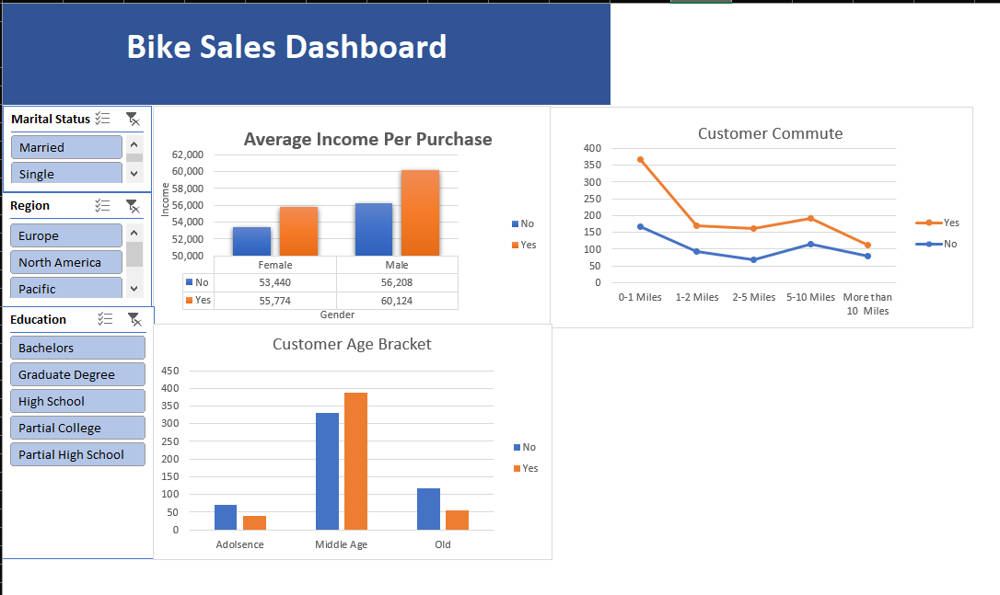

bike-sales-excel-analysis
Beginner Excel data analysis project exploring customer purchasing behavior.
# Bike Sales & Customer Analysis

## Overview

This is my first data analytics portfolio project, created using Microsoft Excel.

The project analyzes customer demographics and purchasing behavior using a bike sales dataset.

## Tools & Skills

- Microsoft Excel
- Data Cleaning
- XLOOKUP / VLOOKUP
- PivotTables
- PivotCharts
- Conditional Formatting
- Data Visualization
- Dashboard Creation

## Project Workflow

1. Cleaned and standardized the dataset
2. Removed duplicate records
3. Used Excel formulas and lookup functions
4. Created PivotTables for analysis
5. Created charts and visualizations
6. Built an interactive dashboard
7. Identified key findings from the data

## Key Findings

- Middle-aged customers accounted for 388 of 481 total bike purchases.
- The 2–5 mile commute group had the highest purchase rate at 58.6%.
- Customers who purchased bikes had a higher average income than non-purchasers.
- Male purchasers had a higher average income than female purchasers.

## Dashboard

## What I Learned

This project helped me practice the fundamentals of Excel-based data analysis, including data cleaning, summarization, visualization, and communicating insights from data.

## Next Steps

I am currently continuing my data analytics learning journey with SQL, followed by Power BI and Python.
